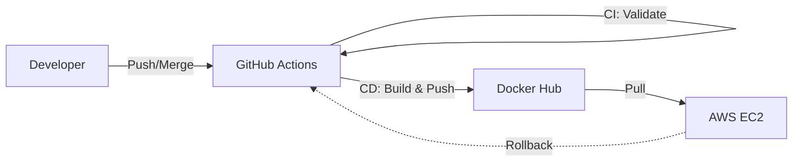

# Lab: CI/CD Infrastructure with Github Actions, Docker and AWS EC2

This project demonstrates how to set up an automated CI/CD pipeline for a Node.js application using GitHub Actions, Docker, and AWS EC2.

## Architecture



## Setup Instructions

### 1. EC2 Configuration
Make sure your EC2 instance's security group allows SSH connections through port 22.  
Install Docker on your instance: https://docs.docker.com/engine/install/  
Setup SSH Keys:
```bash
ssh-keygen -t ed25519
cat ~/.ssh/id_ed25519.pub >> ~/.ssh/authorized_keys
cat ~/.ssh/id_ed25519 (Copy this for Github Secrets)
```

### 2. Github Secrets Configuration
Navigate to Settings > Secrets and variables > Actions > New repository secret and add:

**DOCKER_USERNAME**: Your Docker Hub username  
**DOCKER_PASSWORD**: Docker Hub Access Token (Read,Write,Delete)  
**EC2_HOST**: EC2 Instance's public IPv4 address  
**EC2_USERNAME**: default: ubuntu  
**EC2_SSH_KEY**: Private SSH key copied from the instance  


## Workflow Overview

### Continuous Integration (CI)
Triggered by Pull Requests to main or dev branches  
Runs ****npm check run**** to validate code syntax  
Prevents merging broken code into the main branch  

### Continuous Development (CD)
Triggered automatically when code is merged into main  
**Build**: Creates a Docker image using the current Git commit SHA as a tag  
**Push**: Uploads the image to Docker Hub  
**Deploy**: Connects to EC2 via SSH, pulls the new image, stops the old container, and starts the updated container on port 80  

### Manual Rollback
Manual rollback workflow is available within Actions tab.  
The pipeline will automatically stop the current container and re-deploy the desired image associated with specific commit.  


## Git Workflow

Develop on dev branch
```bash
git checkout -b dev
```

Commit & Push to dev branch
```bash
git add . && git commit -m "feat: your changes" && git push origin dev
```

Merge
```bash
Create a Pull Request to main and merge to trigger automatic deployment.
```


## License
This project is licensed under the MIT License.


